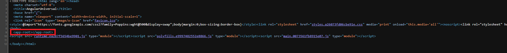
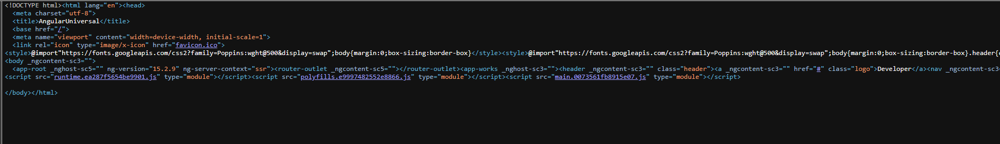

# Angular Universal App

This repository contains an Angular Universal application, which leverages server-side rendering (SSR) to provide better performance and search engine optimization (SEO) capabilities. With Angular Universal, your app can generate HTML on the server and send it to the client, resulting in faster initial page loads and improved user experience.

This project is specifically designed as a demonstration of deploying Angular Universal and focuses solely on the server-side rendering aspect. It does not cover the complete development of the  Angular app.

# Preview

Here are some screenshots of the Angular Universal app in action:

Client Side Rendering 

*Screenshot of page source of a Client Side Rendered app.*

Server Side Rendering 

*Screenshot of page source of a Server-Side Rendered app.*

## Production demo 

[Netlify](https://stalwart-phoenix-dabdb3.netlify.app/)

[Vercel](https://angular-universal-eta.vercel.app/)

## Prerequisites

Before running this Angular Universal app, ensure that you have the following software installed on your machine:

- Node.js: [Download Node.js](https://nodejs.org/en)

- Angular CLI: Install globally using npm install -g @angular/cli

## Installation

Follow these steps to set up and run the Angular Universal app:

- Clone this repository to your local machine.

- Navigate to the project's root directory.

- Run npm install to install the project dependencies.

## Development Server with SSR

To run the development server with server-side rendering, use the following command:

```
npm run dev:ssr
```

## Build

To build the Angular Universal app, execute the following command:

```
npm run build:ssr
```
This command compiles the Angular app and generates the server-side rendering files in the `dist` directory.


## Production Server

To start the production server with server-side rendering, use the following command:

```
npm run serve:ssr
```
This command launches a Node.js server that serves the pre-rendered Angular Universal app. The server will be accessible at `http://localhost:4000`

## Prerendering

You can also generate static HTML files for your app using prerendering. To do this, run the following command

```
npm run prerender
```

This command pre-renders the app and generates static HTML files for each route in the `dist/browser` directory.

## Serve Prerendered App

To serve the prerendered app locally, execute the following command:

```
npm run serve:prerender
```

This command starts a Node.js server that serves the prerendered Angular Universal app from the dist/browser directory. You can access the prerendered app in your browser at `http://localhost:4000`

